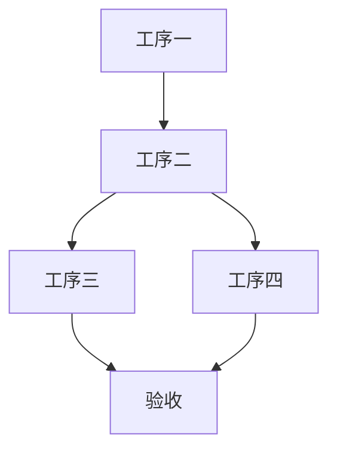

# {{topic}}

<!-- 触发条件（SPEC §3.3）：涉及多道工序时启用本子模板；descriptor 区块仍保留为 Anki 记忆点。 -->

## 工序流程图
<!-- 用 mermaid 画工序/网络图。节点 = 工序，边 = 先后/依赖。
     禁在 prompt 里写"画图"二字（会触发图片生成）。 -->

## 规范条文
<!-- 每道工序对应的规范条款号 + 原文摘录。法规类 note 同步填 frontmatter effective_date。 -->

- **GB XXXXX-YYYY §X.X**：条文摘录
- **GB XXXXX-YYYY §X.X**：条文摘录

## 技术参数
<!-- 定量指标：偏差、数值、阈值。每项需能在 source 回链到出处。 -->

| 项目 | 标准 | 备注 |
|---|---|---|
|  |  |  |

## 易错点

## Descriptors
<!-- 必填（SPEC §3.2）。描述子必须来自 templates/descriptors/建造师.md 词典。
     anki-export.sh 扫描所有 :: 行自动成卡（正反两张）。 -->
工序:: 描述子 → 步骤一→步骤二→步骤三
规范条文:: 描述子 → GB XXXXX-YYYY §X.X

## 自测一题
<!-- 必填：应用验证区块，与 Descriptors 共存。
     Descriptors 管"记没记住"（Anki 数据源），自测题管"会不会用"（回写 mastery）。 -->
